# Diagrama: Ciclo de Vida Completo de una HU

## Flujo desde refinar_hu hasta Completada

```mermaid
flowchart TD
    classDef startEnd fill:#00FF7F26,stroke:#00FF7F,color:#fff
    classDef process fill:#0096FF26,stroke:#0096FF,color:#fff
    classDef decision fill:#FFA50026,stroke:#FFA500,color:#fff
    classDef stateRefined fill:#0096FF26,stroke:#0096FF,color:#fff
    classDef stateApproved fill:#FFA50026,stroke:#FFA500,color:#fff
    classDef statePlanned fill:#FF69B426,stroke:#FF69B4,color:#fff
    classDef stateExecuting fill:#FF000026,stroke:#FF0000,color:#fff
    classDef stateCompleted fill:#00FF7F26,stroke:#00FF7F,color:#fff
    classDef stateBlocked fill:#FF000026,stroke:#FF0000,color:#fff
    classDef bugFlow fill:#FF69B426,stroke:#FF69B4,color:#fff

    INICIO([🚀 INICIO
    Usuario quiere crear HU]) --> REF

    subgraph REFINAR["📝 >refinar_hu — REFINADOR"]
        REF["⚙️ PASO 1: Inicialización
        ─────────────────────────────
        • Establecer defaults
        • Mostrar configuración activa"]

        REF --> WS

        WS["📂 PASO 2: Detectar Workspace
        ─────────────────────────────
        • Leer workspace.md
        • Mono/Multi-Proyecto
        • Cargar contexto"]

        WS --> MOD

        MOD["🔍 PASO 3: Detectar Modo
        ─────────────────────────────
        • ¿Existe carpeta HU?
        → MODO_AJUSTE / MODO_NUEVO
        • ¿Tipo = Bug?
        → Cargar RefinamientoBug.md"]

        MOD --> COMP

        COMP["📊 PASO 4: Evaluación Complejidad
        ─────────────────────────────
        • Analizar indicadores
        • Clasificar: BAJO/MEDIO/ALTO"]

        COMP --> PART

        PART["📦 PASO 5: Partición en Tasks
        ─────────────────────────────
        • SI complejidad >= MEDIO
        AND CAs >= 3
        → Sugerir partición"]

        PART --> PREG

        PREG["❓ PASO 6: Preguntas Clarificación
        ─────────────────────────────
        • Detectar ambigüedades
        • Generar preguntas priorizadas"]

        PREG --> CA

        CA["✅ PASO 7: Refinamiento CAs
        ─────────────────────────────
        • Aplicar SMART
        • Reformular ambiguos
        • Agregar faltantes"]

        CA --> DESG

        DESG["🔧 PASO 8: Desglose Técnico
        ─────────────────────────────
        • Slices end-to-end
        • Tareas por capa
        UI→API→Servicio→DB→Test"]

        DESG --> EST

        EST["📈 PASO 9: Estrategia y Estimación
        ─────────────────────────────
        • Recomendar enfoque
        • Calcular Story Points"]

        EST --> RIESG

        RIESG["⚠️ PASO 10: Análisis Riesgos
        ─────────────────────────────
        • Identificar bloqueadores
        • Proponer mitigaciones"]

        RIESG --> PERS

        PERS["💾 PASO 11: Persistencia
        ─────────────────────────────
        • Crear carpeta SAC-XXX/
        • Copiar HU.md + Refinamiento.md
        • Fila en Índice Rápido [R]"]
    end

    PERS --> STATE_R

    STATE_R["[R] REFINADA
    ─────────────────────────────
    HU.md + Refinamiento.md
    CAs definidos
    Desglose técnico"]

    STATE_R --> VALIDAR

    subgraph VALIDATE["✅ >validar_hu — ARQUITECTO ONAD"]
        VALIDAR["🔍 Validación Arquitectónica
        ─────────────────────────────
        • Validar alineación arquitectónica
        • Verificar CAs cumplen SMART
        • Agregar Aprobación en Refinamiento.md
        • Generar Directrices de Planificación"]
    end

    VALIDAR --> STATE_A

    STATE_A["[A] APROBADA
    ─────────────────────────────
    + ## Aprobación
    Directrices de Planificación"]

    STATE_A --> PLANIFICAR

    subgraph PLAN["📋 >planificar_hu — ARCHDEV PRO"]
        PLANIFICAR["📊 Planificación
        ─────────────────────────────
        • Leer HU.md + Refinamiento.md
        • SI Tipo=Bug → Cargar RefinamientoBug.md
        • Definir fases de implementación
        • Crear tareas EJEC-XX
        • Generar Plan.md"]
    end

    PLANIFICAR --> STATE_P

    STATE_P["[P] PLANIFICADA
    ─────────────────────────────
    + Plan.md
    Estado: PENDIENTE
    Fases y tareas"]

    STATE_P --> EJECUTAR

    subgraph EJEC["⚡ >ejecutar_plan — DESARROLLADOR"]
        EJECUTAR["💻 Ejecución
        ─────────────────────────────
        • Leer Plan.md
        • Ejecutar tareas EJEC-XX
        • Crear Tracking.md
        • Actualizar estado tareas
        • SI error → Reintentar/reportar"]
    end

    EJECUTAR --> STATE_E

    STATE_E["[E] EN EJECUCIÓN
    ─────────────────────────────
    + Tracking.md
    Progreso en tiempo real"]

    STATE_E --> FINALIZAR

    FINALIZAR["✅ Finalizar
    Plan.md: COMPLETADO"] --> STATE_X

    STATE_X["[X] COMPLETADA
    ─────────────────────────────
    Plan.md Estado: COMPLETADO
    Todas las tareas finalizadas"]

    STATE_X --> FIN([🏁 FIN])

    %% Estado especial: Bloqueada
    STATE_B["[B] BLOQUEADA
    ─────────────────────────────
    Puede ocurrir en
    cualquier momento
    Con dependencias
    no resueltas"]

    STATE_R -.->|"Dependencia
    no resuelta"| STATE_B
    STATE_A -.->|"Dependencia
    no resuelta"| STATE_B
    STATE_P -.->|"Dependencia
    no resuelta"| STATE_B
    STATE_E -.->|"Dependencia
    no resuelta"| STATE_B
    STATE_B -.->|"Dependencia
    resuelta"| STATE_R
    STATE_B -.->|"Dependencia
    resuelta"| STATE_A
    STATE_B -.->|"Dependencia
    resuelta"| STATE_P
    STATE_B -.->|"Dependencia
    resuelta"| STATE_E

    %% Flujo especial: Bugs
    BUG_START([🐛 Bug encontrado]) --> REG_BUG

    subgraph BUG["🐛 Flujo Especial: Bugs"]
        REG_BUG[">registrar_bug
        ─────────────────────────────
        Crea HU tipo Bug
        directamente en [P]"]
    end

    REG_BUG --> STATE_P

    class INICIO,FIN,BUG_START startEnd
    class REF,WS,MOD,COMP,PART,PREG,CA,DESG,EST,RIESG,PERS process
    class VALIDAR,PLANIFICAR,EJECUTAR,FINALIZAR process
    class STATE_R stateRefined
    class STATE_A stateApproved
    class STATE_P statePlanned
    class STATE_E stateExecuting
    class STATE_X stateCompleted
    class STATE_B stateBlocked
    class REG_BUG bugFlow
```

## Notas

- **Versión:** 7.25.0 — Paradigma de carpetas individuales por HU
- **Detección de Estado:** Inferida por archivos existentes en la carpeta HU
- **Flujo Normal:** [ ] → [R] → [A] → [P] → [E] → [X]
- **Flujo Bugs:** Salta directamente a [P] (sin refinar_hu ni validar_hu)
- **Estado [B]:** Puede ocurrir en cualquier momento si hay dependencias no resueltas
- **Herramientas por Rol:**
  - Refinador: `>refinar_hu`
  - Arquitecto: `>validar_hu`
  - ArchDev Pro: `>planificar_hu`
  - Desarrollador: `>ejecutar_plan`

## Tabla de Detección de Estado

| Archivos Existentes | Estado Deducido |
|---------------------|-----------------|
| `SAC-XXX/HU.md` | `[ ]` Pendiente |
| `+ Refinamiento.md` | `[R]` Refinada |
| `+ ## Aprobación` en Refinamiento.md | `[A]` Aprobada |
| `+ Plan.md` | `[P]` Planificada |
| `+ Tracking.md` | `[E]` En Ejecución |
| `Plan.md Estado: COMPLETADO` | `[X]` Completada |
