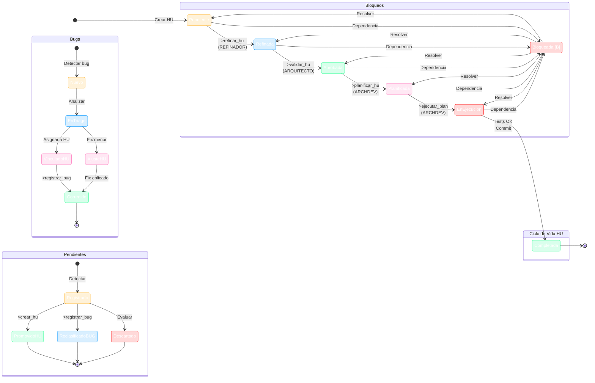

# 🔄 Diagrama de Ciclo de Vida del Sistema SAC

> **Sistema:** SAC - Sistema Agéntico COCHAS
> **Versión:** 7.25.0
> **Última Actualización:** 3 de julio de 2026

---

## 📖 Descripción

Este diagrama de estado muestra el **ciclo de vida completo** del sistema SAC, incluyendo:
- Historias de Usuario (HU)
- Bugs
- Pendientes y Hallazgos

---

## 🎨 Leyenda de Colores

| Color | Significado |
|-------|-------------|
| 🟠 Naranja | Estados iniciales / Pendientes |
| 🔵 Azul | Procesos de análisis y refinamiento |
| 🟢 Verde | Estados de éxito / Completados |
| 🩷 Rosa | Planificación y ejecución |
| 🔴 Rojo | Bloqueos / Estados críticos |

---

## 🔄 Diagrama de Estado Principal

---

## 📋 Estados de las HU

| Estado | Símbolo | Descripción | Responsable |
|--------|---------|-------------|-------------|
| Pendiente | `[ ]` | HU creada, sin analizar | - |
| Refinada | `[R]` | Analizada con criterios y estimación | Refinador HU |
| Aprobada | `[A]` | Validada arquitectónicamente | Arquitecto Onad |
| Planificada | `[P]` | Tiene plan de implementación | ArchDev Pro |
| En Ejecución | `[E]` | Agente está ejecutando el plan | ArchDev Pro |
| Completada | `[X]` | Implementación terminada | ArchDev Pro |
| Bloqueada | `[B]` | Dependencias no resueltas | Cualquier rol |

---

## 🐛 Estados de los Bugs

| Estado | Descripción |
|--------|-------------|
| Nuevo | Bug detectado, sin analizar |
| En Triage | Analizando causa raíz |
| Vinculado a HU | Asignado a una HU para corrección |
| Ajuste en HU | Fix menor aplicado directamente |
| Corregido | Bug solucionado |

---

## 📝 Estados de los Pendientes

| Estado | Descripción |
|--------|-------------|
| Registrado | Pendiente documentado |
| Promovido a HU | Convertido en Historia de Usuario |
| Reclasificado a BUG | Convertido en Bug |
| Descartado | Evaluado y descartado |

---

## 🔗 Referencias

- [Guía del Ciclo de Vida de Tareas](guia_ciclo_vida_tareas.md)
- [Plantilla de HU](../../plantillas/hu/HU.md)
- [Plantilla de Bug](../../plantillas/bug_plantilla.md)
- [Plantilla de Pendientes](../../plantillas/pendientes_plantilla.md)
