# Diagrama: registrar_bug.tool.yaml v3.0

## Flujo de Registro de Bug

```mermaid
flowchart TD
    classDef startEnd fill:#00FF7F26,stroke:#00FF7F,color:#fff
    classDef process fill:#0096FF26,stroke:#0096FF,color:#fff
    classDef decision fill:#FFA50026,stroke:#FFA500,color:#fff
    classDef bugState fill:#FF000026,stroke:#FF0000,color:#fff
    classDef success fill:#00FF7F26,stroke:#00FF7F,color:#fff

    INICIO([🚀 INICIO]) --> P1

    subgraph PROCESO["🐛 REGISTRAR BUG v3.0"]
        P1["📥 PASO 1: Recepción del Bug
        ─────────────────────────────
        • Recopilar descripción, proyecto, contexto
        • Asignar ID autoincremental BUG-NNN
        • SI --ya_corregido → Recopilar commit, código"]

        P1 --> P2

        P2["📊 PASO 2: Clasificación de Severidad
        ─────────────────────────────
        🔴 Crítica: Bloquea core, pérdida datos
        🟠 Alta: Degradada, workaround difícil
        🟡 Media: Menor, workaround disponible
        
        Mostrar propuesta y confirmar con usuario"]

        P2 --> P3

        P3["🔍 PASO 3: Análisis de Causa Raíz
        ─────────────────────────────
        • Documentar síntoma observable
        • Identificar causa raíz técnica
        • Listar archivos afectados"]

        P3 --> D1
    end

    D1{"¿Es --ya_corregido?
    (flag desde inicio)"}

    D1 -->|"SÍ"| P5
    D1 -->|"NO"| P4

    subgraph CONTEXTO["🔗 PASO 4: Contextualización"]
        P4["🔎 Buscar HU de Origen
        ─────────────────────────────
        • Leer backlog
        • Buscar HUs relacionadas
        • Preguntar al usuario"]

        P4 --> D2

        D2{"¿Detectado en
        alguna HU?"}

        D2 -->|"[HU-XXX] Sí"| CTX1
        D2 -->|"[N] No"| CTX2

        CTX1["📝 Registrar
        detectado_en = HU-XXX"]
        CTX2["📝 Registrar
        detectado_en = contexto"]
    end

    CTX1 --> P5
    CTX2 --> P5

    subgraph CREAR["📁 PASO 5: Crear HU tipo Bug"]
        P5["📂 Crear carpeta BUG-NNN/
        ─────────────────────────────
        📄 HU.md
        • Tipo: Bug
        • Prioridad según severidad
        • Complejidad inferida
        
        📄 RefinamientoBug.md
        • Síntoma, Causa Raíz
        • Archivos Afectados
        • Corrección Sugerida (SUGERIDA)
        • CA-01: Bug no se reproduce"]

        P5 --> P5B

        P5B["📋 Agregar fila a
        Índice Rápido del backlog"]
    end

    P5B --> D3

    D3{"¿Usuario indica que
    ya fue corregido
    durante el proceso?"}

    D3 -->|"SÍ"| P6
    D3 -->|"NO"| ESTADO_NUEVO

    subgraph CORRECCION["✅ Documentar Corrección"]
        P6["📝 PASO 6: Documentar Corrección
        ─────────────────────────────
        • Registrar commit fix
        • Código Antes/Después
        • Fecha de corrección"]

        P6 --> P7

        P7["🧠 PASO 7: Lección Aprendida
        ─────────────────────────────
        • Máx 3 líneas
        • Acción preventiva concreta
        • Agregar a lecciones_aprendidas"]
    end

    P7 --> ESTADO_CORREGIDO

    ESTADO_NUEVO["🆕 Estado:
    HU-Bug Planificable
    
    Siguiente:
    >planificar_hu BUG-NNN"]

    ESTADO_CORREGIDO["✅ Estado:
    Corregido"]

    ESTADO_NUEVO --> FIN
    ESTADO_CORREGIDO --> FIN

    FIN([✅ FIN])

    class INICIO,FIN startEnd
    class P1,P2,P3,P4,P5,P5B process
    class D1,D2,D3 decision
    class P6,P7 process
    class ESTADO_NUEVO bugState
    class ESTADO_CORREGIDO success
```

## Notas

- **Versión:** 3.0 — Compatible con paradigma v7.25.0
- **Carpeta:** Los bugs viven en `{{artifacts.hu_folder}}/BUG-NNN/`
- **Archivos:** HU.md + RefinamientoBug.md (NO BUG-NNN.md separado)
- **Flujo dual:** Flag `--ya_corregido` desde inicio vs indicación durante proceso
- **Siguiente paso:** `>planificar_hu BUG-NNN` (sin refinar_hu ni validar_hu)
