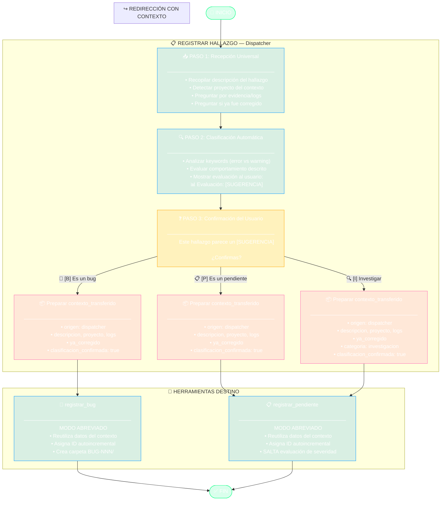

# Diagrama: registrar_hallazgo.tool.yaml

## Flujo del Dispatcher de Clasificación

## Notas

- **Dispatcher**: Esta herramienta NO genera archivos propios
- **Contexto Transferido**: Todos los datos se pasan a la herramienta destino
- **Modo Abreviado**: Las herramientas destino reutilizan datos sin duplicar trabajo
- **Restricción de Rol**: Si el Desarrollador elige [P], se informa que es exclusivo del Arquitecto
