# Diagrama: registrar_pendiente.tool.yaml v3.0

## Flujo de Registro de Pendiente (Solo Arquitecto)

```mermaid
flowchart TD
    classDef startEnd fill:#00FF7F26,stroke:#00FF7F,color:#fff
    classDef process fill:#0096FF26,stroke:#0096FF,color:#fff
    classDef decision fill:#FFA50026,stroke:#FFA500,color:#fff
    classDef redirect fill:#FF69B426,stroke:#FF69B4,color:#fff
    classDef warning fill:#FF000026,stroke:#FF0000,color:#fff
    classDef success fill:#00FF7F26,stroke:#00FF7F,color:#fff

    INICIO([🚀 INICIO]) --> P1

    subgraph PROCESO["📋 REGISTRAR PENDIENTE v3.0 — Solo Arquitecto"]
        P1["📥 PASO 1: Recepción del Pendiente
        ─────────────────────────────
        • Recopilar descripción
        • Asignar ID autoincremental PND-NNN
        • Determinar nivel de detalle:
        - DETALLADO: logs o descripción >3 líneas
        - RÁPIDO: solo fila en tabla"]

        P1 --> P2
    end

    subgraph EVALUACION["⚠️ PASO 2: Evaluación de Severidad"]
        P2{"¿Afecta funcionalidad
        ACTUALMENTE?"}

        P2 -->|"SÍ"| CONFIRMA_BUG
        P2 -->|"NO"| P3

        CONFIRMA_BUG["⚠️ Este hallazgo afecta
        funcionalidad activa
        
        ¿Reclasificar como bug?"]

        CONFIRMA_BUG -->|"[B] Sí"| REDIRIGIR
        CONFIRMA_BUG -->|"[P] No"| P3
    end

    REDIRIGIR["↪️ Redirigir a
    >registrar_bug"] --> FIN

    subgraph CATEGORIZACION["🏷️ PASO 3: Categorización"]
        P3["📂 Determinar Categoría
        ─────────────────────────────
        🔧 Deuda Técnica
        🎨 Mejora UX
        ⚡ Optimización
        🔍 Verificación
        🧪 Investigación
        📎 Con Evidencia"]

        P3 --> P3B

        P3B["📊 Asignar Prioridad
        ─────────────────────────────
        🟡 Baja: Puede esperar
        🟠 Media: Próximas iteraciones
        
        ⚠️ Alta → Reclasificar como bug"]
    end

    P3B --> P4

    subgraph VINCULACION["🔗 PASO 4: Vinculación Opcional"]
        P4{"¿HU relacionada?"}

        P4 -->|"[HU-XXX] Sí"| VINC1
        P4 -->|"[—] No"| VINC2

        VINC1["📝 Registrar
        hu_relacionada = HU-XXX"]
        VINC2["📝 Sin vinculación"]
    end

    VINC1 --> P5
    VINC2 --> P5

    subgraph REGISTRO["📄 PASO 5: Registro en Tabla"]
        P5["📋 Agregar fila en
        pendientes.md
        ─────────────────────────────
        | PND-NNN | Categoría |
        | Descripción | Prioridad |
        | HU Relacionada | Fecha |
        | Estado: 📝 Registrado |"]
    end

    P5 --> D1

    D1{"¿Nivel DETALLADO?"}

    D1 -->|"SÍ"| P6
    D1 -->|"NO"| FIN_OK

    subgraph DETALLE["📁 PASO 6: Archivo Individual"]
        P6["📄 Crear PND-NNN_descripcion.md
        ─────────────────────────────
        En: {{artifacts.pendientes_folder}}/
        
        • Metadata (ID, Categoría, Prioridad)
        • Descripción completa
        • Evidencia/Logs (si adjuntos)
        • Análisis Previo (si hay)
        • Resolución (vacía — se completa después)"]
    end

    P6 --> FIN_OK

    FIN_OK["✅ Estado: 📝 Registrado
    
    Siguiente:
    Continuar tarea actual
    o >registrar_bug si afecta"]

    FIN_OK --> FIN
    FIN([✅ FIN])

    class INICIO,FIN startEnd
    class P1,P3,P3B,P5,P6 process
    class P2,P4,D1 decision
    class CONFIRMA_BUG warning
    class REDIRIGIR redirect
    class VINC1,VINC2 process
    class FIN_OK success
```

## Notas

- **Versión:** 3.0 — Compatible con paradigma v7.25.0
- **Restricción:** Solo el Arquitecto puede ejecutar esta herramienta
- **Ubicación:** Tabla central `pendientes.md` + archivos individuales condicionales
- **Categorías:** Deuda Técnica, Mejora UX, Optimización, Verificación, Investigación, Con Evidencia
- **Prioridad:** Baja o Media (Alta se reclasifica como bug)
- **Evolución:** Un pendiente puede promoverse a HU o reclasificarse como bug
