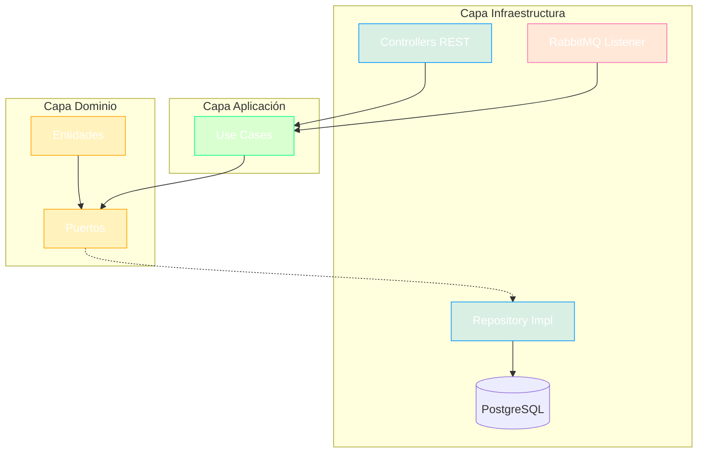

# Contexto del Proyecto: ms-banca-auditoria

> **Generado:** 2026-02-15  
> **Confianza:** Alto

---

## 📊 Scorecard Ejecutivo

| Aspecto | Puntuación | Estado |
|---------|------------|--------|
| Arquitectura | 9/10 | ✅ Hexagonal + DDD |
| Stack | 9/10 | ✅ Java 21, Spring Boot 3.5.5 |
| Testing | 7/10 | ⚠️ Tests presentes, cobertura variable |
| DevOps | 9/10 | ✅ CI/CD completo + K8s |
| Documentación | 6/10 | ⚠️ README básico |

---

## 1. Identificación

- **Nombre:** ms-banca-auditoria (MSBancaAuditoria)
- **Descripción:** Microservicio de auditoría para registro de interacciones y eventos del sistema.
- **Tipo:** Microservicio
- **Estado:** Producción
- **Group ID:** co.com.bmm

---

## 2. Stack Tecnológico

### Resumen
| Categoría | Tecnología | Versión |
|-----------|------------|---------|
| Lenguaje | Java | 21 |
| Framework | Spring Boot | 3.5.5 |
| Spring | Spring Framework | 6.2.10 |
| Build | Gradle | 8.x |
| BD | PostgreSQL | (Flyway migrations) |
| Mensajería | RabbitMQ | - |
| API Docs | SpringDoc OpenAPI | 2.8.9 |
| Testing | JUnit 5, Mockito | 3.11.2 |
| Arquitectura | ArchUnit | 1.4.1 |

### Dependencias Core
| Dependencia | Versión | Propósito |
|-------------|---------|-----------|
| spring-boot-starter-web | 3.5.5 | REST API |
| spring-boot-starter-amqp | 3.5.5 | RabbitMQ |
| spring-boot-starter-jdbc | 3.5.5 | Base de datos |
| flyway-core | 10.1.0 | Migraciones DB |
| springdoc-openapi | 2.8.9 | Documentación API |
| spring-boot-starter-undertow | 3.5.5 | Servidor HTTP |

### Herramientas de Desarrollo
| Herramienta | Propósito | Config |
|-------------|-----------|--------|
| JaCoCo | Cobertura | build.gradle |
| Pitest | Mutación | build.gradle |
| OWASP | Seguridad deps | build.gradle |
| Gitleaks | Secretos | .gitleaks.toml |

---

## 3. Comandos Clave

```bash
# Build
cd microservicio && ./gradlew clean build

# Tests
./gradlew test

# Docker local
docker-compose up -d

# Ejecutar
./gradlew bootRun
```

---

## 4. Arquitectura

- **Estilo:** Hexagonal (Ports and Adapters)
- **Patrón Principal:** DDD Táctico + Repository

### Estructura del Proyecto
```
ms-banca-auditoria/
├── microservicio/
│   ├── dominio/                    # Core domain
│   │   └── src/main/java/co/com/bmm/auditoria_interaccion/
│   │       ├── entidad/            # Entidades de dominio
│   │       └── puerto/             # Puertos (interfaces)
│   ├── aplicacion/                 # Use cases
│   ├── infraestructura/            # Adapters
│   └── src/                        # Main app
├── comun/                          # Módulos compartidos locales
│   ├── comun-dominio/
│   ├── comun-aplicacion/
│   ├── comun-infraestructura/
│   └── comun-test/
├── Dockerfile
├── deployment.yaml
└── docker-compose.yml
```

### Componentes Principales
| Componente | Ubicación | Responsabilidad |
|------------|-----------|-----------------|
| Entidades | dominio/entidad/ | Entidades de auditoría |
| Puertos | dominio/puerto/ | Interfaces de dominio |
| Application | src/ | Punto de entrada Spring Boot |
| Adapters | infraestructura/ | Implementaciones (DB, MQ) |

---

## 5. Integraciones

| Tipo | Tecnología | Configuración |
|------|------------|---------------|
| BD Principal | PostgreSQL | Flyway migrations |
| Cache | N/A | - |
| Mensajería | RabbitMQ | AMQP |
| APIs Externas | N/A | - |
| Secretos | HashiCorp Vault | VAULT_* env vars |

---

## 6. DevOps

| Aspecto | Estado | Archivo |
|---------|--------|---------|
| Dockerfile | ✅ | Dockerfile |
| Docker Compose | ✅ | docker-compose.yml |
| CI/CD | ✅ | azure-pipelines.yml |
| IaC | ✅ | deployment.yaml (K8s) |

**Puertos:** 8080  
**Profiles:** develop, prepro, pro  
**Health Checks:** /api/v1/actuator/health/readiness, /api/v1/actuator/health/liveness

---

## 7. Convenciones

### Código
| Elemento | Convención | Ejemplo |
|----------|------------|---------|
| Clases | PascalCase | AuditoriaInteraccion |
| Métodos | camelCase | registrarEvento() |
| Paquetes | lowercase | auditoria_interaccion |

### Proyecto
- **Commits:** Conventional Commits
- **Branching:** GitFlow (main, develop, prepro)
- **Estructura:** Por capa (dominio, aplicacion, infraestructura)

---

## 8. Puntos de Atención

### 🟢 Sugerencias
- Documentar eventos de auditoría con ADR
- Definir retención de datos de auditoría

---

## 9. Diagrama de Arquitectura Interna



---

## 📜 Historial

| Fecha | Acción | Detalle |
|-------|--------|---------|
| 2026-02-15 | Análisis inicial | Generado por >tomar_contexto |

---

> **Archivo generado automáticamente.**  
> **Proyecto:** ms-banca-auditoria  
> **Workspace:** bmm

