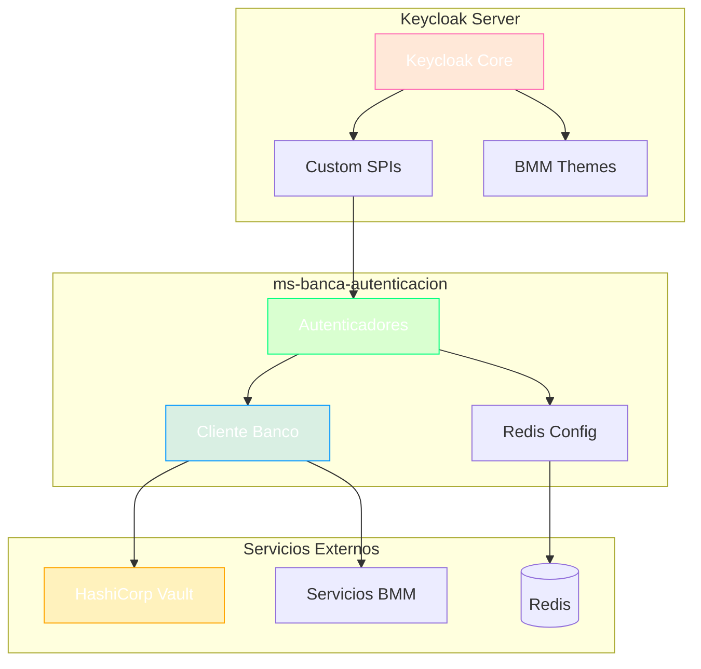

# Contexto del Proyecto: ms-banca-autenticacion

> **Generado:** 2026-02-15  
> **Confianza:** Alto

---

## 📊 Scorecard Ejecutivo

| Aspecto | Puntuación | Estado |
|---------|------------|--------|
| Arquitectura | 8/10 | ✅ Keycloak SPI |
| Stack | 9/10 | ✅ Java 21, Keycloak 26.2.4 |
| Testing | 8/10 | ✅ Cobertura 80% enforced |
| DevOps | 9/10 | ✅ CI/CD completo + K8s |
| Documentación | 6/10 | ⚠️ README presente |

---

## 1. Identificación

- **Nombre:** ms-banca-autenticacion
- **Descripción:** Servicio de autenticación basado en Keycloak con SPI personalizado para integración con el banco.
- **Tipo:** Microservicio (Keycloak Extension)
- **Estado:** Producción
- **Group ID:** com.bmm.banca

---

## 2. Stack Tecnológico

### Resumen
| Categoría | Tecnología | Versión |
|-----------|------------|---------|
| Lenguaje | Java | 21 |
| Base | Keycloak | 26.2.4 |
| Build | Gradle + Shadow | 8.1.1 |
| Cache | Redis | - |
| Testing | JUnit 5, Mockito | - |
| Cobertura | JaCoCo | 0.8.11 |

### Dependencias Core
| Dependencia | Versión | Propósito |
|-------------|---------|-----------|
| Keycloak SPI | 26.2.4 | Extension points |
| libBancaTransversales | 1.0.x | Cliente servicios BMM |
| Redis | - | Sesiones/Cache |
| Jackson | - | JSON processing |

### Herramientas de Desarrollo
| Herramienta | Propósito | Config |
|-------------|-----------|--------|
| JaCoCo | Cobertura 80% min | build.gradle |
| Pitest | Mutación | build.gradle |
| Shadow | Fat JAR | build.gradle |

---

## 3. Comandos Clave

```bash
# Build (genera JAR para Keycloak providers)
./gradlew clean build

# Tests con cobertura
./gradlew test jacocoTestReport

# Verificar cobertura mínima
./gradlew jacocoTestCoverageVerification

# Docker local con Keycloak
docker-compose -f docker-compose.keycloak.yml up -d
```

---

## 4. Arquitectura

- **Estilo:** Keycloak SPI (Service Provider Interface)
- **Patrón Principal:** Factory + Strategy (Authenticators)

### Estructura del Proyecto
```
ms-banca-autenticacion/
├── src/main/java/co/com/bmm/autenticacion/
│   ├── cliente/                    # Cliente HTTP para servicios banco
│   │   ├── adaptador/              # Adaptadores HTTP
│   │   ├── config/                 # Configuración (Vault, Certs)
│   │   ├── dto/                    # Data Transfer Objects
│   │   └── excepcion/              # Excepciones custom
│   ├── modelo/                     # Modelos de dominio
│   │   └── repositorio/            # Interfaces repository
│   ├── redis/                      # Configuración Redis
│   ├── resource/                   # JAX-RS Resources
│   ├── spi/                        # Keycloak SPIs
│   │   └── *Fabrica.java           # Factories para SPIs
│   └── util/                       # Utilidades
├── themes/                         # Temas personalizados Keycloak
│   └── bmm-cliente/
│       └── login/
├── Dockerfile
├── deployment.yml
└── docker-compose.keycloak.yml
```

### Componentes Principales
| Componente | Ubicación | Responsabilidad |
|------------|-----------|-----------------|
| SPIs | spi/ | Autenticadores personalizados |
| Factories | spi/*Fabrica | Creación de autenticadores |
| Cliente Banco | cliente/ | Comunicación con servicios BMM |
| Themes | themes/ | UI personalizada login |
| Redis Config | redis/ | Gestión de sesiones |

---

## 5. Integraciones

| Tipo | Tecnología | Configuración |
|------|------------|---------------|
| Cache/Sesiones | Redis | docker-compose.redis.yml |
| Servicios Banco | HTTP | cliente/adaptador/ |
| Secretos | HashiCorp Vault | cliente/config/vault/ |
| Certificados | X.509 | cliente/config/certificados/ |

---

## 6. DevOps

| Aspecto | Estado | Archivo |
|---------|--------|---------|
| Dockerfile | ✅ | Dockerfile (basado en Keycloak) |
| Docker Compose | ✅ | docker-compose.keycloak.yml |
| CI/CD | ✅ | azure-pipelines.yml |
| IaC | ✅ | deployment.yml (K8s) |

**Puertos:** 8080 (HTTP), 9000 (Management)  
**Base Image:** quay.io/keycloak/keycloak:26.2.4  
**Profiles:** develop, prepro, pro

---

## 7. Convenciones

### Código
| Elemento | Convención | Ejemplo |
|----------|------------|---------|
| Clases | PascalCase | AutenticadorBmm |
| SPIs | *Provider | MiAutenticadorProvider |
| Factories | *Fabrica | AutenticadorBmmFabrica |

### Proyecto
- **Commits:** Conventional Commits
- **Branching:** GitFlow
- **Cobertura:** Mínimo 80% (enforced)

---

## 8. Exclusiones de Cobertura

Las siguientes clases están excluidas del requerimiento de 80% de cobertura:
- `Main` - Clase de arranque
- `*.resource.*` - JAX-RS Resources
- `*.redis.*` - Configuración Redis
- `*.adaptador.*` - Adaptadores HTTP
- `*.config.*` - Configuración
- `*.dto.*` - DTOs
- `*.excepcion.*` - Excepciones
- `*.modelo.*` - Modelos simples

---

## 9. Puntos de Atención

### 🟠 Importantes
- El JAR se despliega en `/opt/keycloak/providers/`
- Los certificados CA deben importarse en el truststore de la JVM
- Dependencia de Vault para secretos

### 🟢 Sugerencias
- Documentar flujos de autenticación con ADR
- Agregar tests de integración con Keycloak testcontainers

---

## 10. Diagrama de Arquitectura



---

## 📜 Historial

| Fecha | Acción | Detalle |
|-------|--------|---------|
| 2026-02-15 | Análisis inicial | Generado por >tomar_contexto |

---

> **Archivo generado automáticamente.**  
> **Proyecto:** ms-banca-autenticacion  
> **Workspace:** bmm

