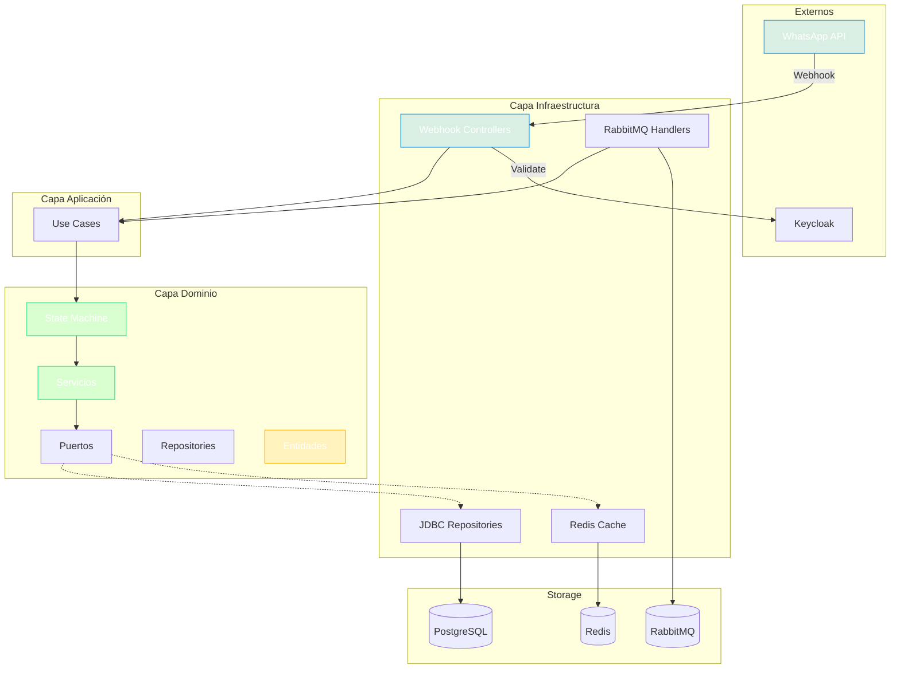

# Contexto del Proyecto: ms-banca-conversacion

> **Generado:** 2026-02-15  
> **Confianza:** Alto

---

## 📊 Scorecard Ejecutivo

| Aspecto | Puntuación | Estado |
|---------|------------|--------|
| Arquitectura | 9/10 | ✅ Hexagonal + DDD + Event-Driven |
| Stack | 9/10 | ✅ Java 21, Spring Boot 3.5.4 |
| Testing | 8/10 | ✅ 200+ tests |
| DevOps | 9/10 | ✅ CI/CD completo + K8s |
| Documentación | 7/10 | ✅ README + PROJECT_KB.md |

---

## 1. Identificación

- **Nombre:** ms-banca-conversacion (MSBancaConversacion)
- **Descripción:** Orquestador principal del flujo conversacional de WhatsApp Business. Gestiona webhooks, máquina de estados, flujos de interacción y comunicación con otros microservicios.
- **Tipo:** Microservicio (Orquestrador)
- **Estado:** Producción
- **Group ID:** co.com.bmm

---

## 2. Stack Tecnológico

### Resumen
| Categoría | Tecnología | Versión |
|-----------|------------|---------|
| Lenguaje | Java | 21 |
| Framework | Spring Boot | 3.5.4 |
| Spring | Spring Framework | 6.2.7 |
| Build | Gradle | 8.x |
| BD | PostgreSQL | (Flyway 11.11.2) |
| Mensajería | RabbitMQ | - |
| Cache | Redis | 7.2 |
| Mapping | MapStruct | 1.6.3 |
| API Docs | SpringDoc OpenAPI | 2.3.0 |
| Testing | JUnit 5.13.4, Mockito 5.18.0 | - |

### Dependencias Core
| Dependencia | Versión | Propósito |
|-------------|---------|-----------|
| spring-boot-starter-web | 3.5.4 | REST API (Undertow) |
| spring-boot-starter-amqp | 3.5.4 | RabbitMQ |
| spring-boot-starter-jdbc | 3.5.4 | Base de datos |
| flyway-core | 11.11.2 | Migraciones DB |
| jackson-databind | 2.19.2 | JSON |
| mapstruct | 1.6.3 | Object mapping |
| archunit-junit5 | 1.3.0 | Tests arquitectura |

### Herramientas de Desarrollo
| Herramienta | Propósito | Config |
|-------------|-----------|--------|
| Lombok | Boilerplate | Gradle plugin |
| JaCoCo | Cobertura | build.gradle |
| OWASP | Seguridad deps | build.gradle |
| Gitleaks | Secretos | .gitleaks.toml |

---

## 3. Comandos Clave

```bash
# Build
cd microservicio && ./gradlew clean build

# Tests
./gradlew test

# Docker local (incluye PostgreSQL, RabbitMQ, Redis)
docker-compose up -d

# Ejecutar
./gradlew bootRun
```

---

## 4. Arquitectura

- **Estilo:** Hexagonal (Ports and Adapters) + Event-Driven
- **Patrón Principal:** DDD Táctico + State Machine + Repository

### Estructura del Proyecto
```
ms-banca-conversacion/
├── microservicio/
│   ├── dominio/src/main/java/co/com/bmm/
│   │   ├── auditoria/              # Auditoría de interacciones
│   │   ├── dto/                    # DTOs de dominio
│   │   ├── excepciones/            # Excepciones de negocio
│   │   ├── FabricaInteraccion.java # Factory
│   │   ├── mapeador/               # Mapeadores
│   │   ├── maquina_estados/        # State Machine
│   │   ├── mensaje/                # Mensajería
│   │   ├── modelo/                 # Entidades de dominio
│   │   ├── puerto/                 # Puertos (interfaces)
│   │   ├── repository/             # Repository interfaces
│   │   ├── servicio/               # Servicios de dominio
│   │   └── webhook/                # Webhook models
│   ├── aplicacion/                 # Use cases
│   ├── infraestructura/            # Adapters
│   │   ├── webhook/                # WhatsApp webhook handlers
│   │   ├── jdbc/                   # JDBC repositories
│   │   ├── mensaje/                # RabbitMQ handlers
│   │   └── servicio/               # External services
│   └── src/                        # Main app
├── comun/                          # Módulos compartidos locales
├── redis-config/                   # Configuración Redis
├── conf/                           # Configuraciones adicionales
├── Dockerfile
├── deployment.yaml
└── docker-compose.yml
```

### Componentes Principales
| Componente | Ubicación | Responsabilidad |
|------------|-----------|-----------------|
| Webhook Controllers | infraestructura/webhook/ | Recepción eventos WhatsApp |
| State Machine | dominio/maquina_estados/ | Flujo conversacional |
| Puertos | dominio/puerto/ | 20+ interfaces de dominio |
| Repositories | dominio/repository/ | 6+ interfaces de persistencia |
| Message Handlers | infraestructura/mensaje/ | Consumo eventos RabbitMQ |
| JDBC Repos | infraestructura/jdbc/ | Implementaciones PostgreSQL |

---

## 5. Integraciones

| Tipo | Tecnología | Configuración |
|------|------------|---------------|
| BD Principal | PostgreSQL | Flyway (11.11.2) |
| Cache | Redis | 7.2-alpine |
| Mensajería | RabbitMQ | 3.12-management |
| WhatsApp | Business API | Webhooks |
| Autenticación | Keycloak | Token validation |
| Secretos | HashiCorp Vault | VAULT_* env vars |

---

## 6. DevOps

| Aspecto | Estado | Archivo |
|---------|--------|---------|
| Dockerfile | ✅ | Dockerfile |
| Docker Compose | ✅ | docker-compose.yml |
| CI/CD | ✅ | azure-pipelines.yml |
| IaC | ✅ | deployment.yaml (K8s) |

**Puertos:** 8080  
**Profiles:** develop, prepro, pro  
**Health Checks:** /api/v1/actuator/health/*

---

## 7. Puertos de Dominio (Interfaces)

| Puerto | Responsabilidad |
|--------|-----------------|
| PuertoFlujoInteraccion | Gestión flujo conversacional |
| PuertoCatalogoFlujos | Catálogo de flujos |
| PuertoGuardarInteraccion | Persistencia interacciones |
| PuertoGuardarEncuestaSatisfaccion | Encuestas |
| PuertoSesionAutenticada | Gestión sesiones auth |
| PuertoValidacionSesionDuplicada | Validación sesiones |
| PuertoMapeadorDeObjetos | Object mapping |
| PuertoAlmacenDatosReferido | Datos referidos |
| PuertoAlmacenDatosReferente | Datos referentes |

---

## 8. Repositorios de Dominio

| Repository | Responsabilidad |
|------------|-----------------|
| InteraccionRepository | CRUD interacciones |
| PlantillaMensajeRepository | Plantillas de mensajes |
| EncuestaSatisfaccionRepository | Encuestas |
| DatosSesionAgenteHumanoRepository | Sesiones agente humano |
| SesionAutenticadaRepository | Sesiones autenticadas |

---

## 9. Diagrama de Arquitectura



---

## 10. Puntos de Atención

### 🟠 Importantes
- Microservicio crítico: orquesta toda la comunicación
- Alta complejidad en máquina de estados
- Múltiples integraciones externas

### 🟢 Sugerencias
- Documentar flujos de estado con ADR
- Considerar circuit breaker para integraciones
- PROJECT_KB.md disponible para consulta rápida

---

## 📜 Historial

| Fecha | Acción | Detalle |
|-------|--------|---------|
| 2026-02-15 | Análisis inicial | Generado por >tomar_contexto |

---

> **Archivo generado automáticamente.**  
> **Proyecto:** ms-banca-conversacion  
> **Workspace:** bmm

