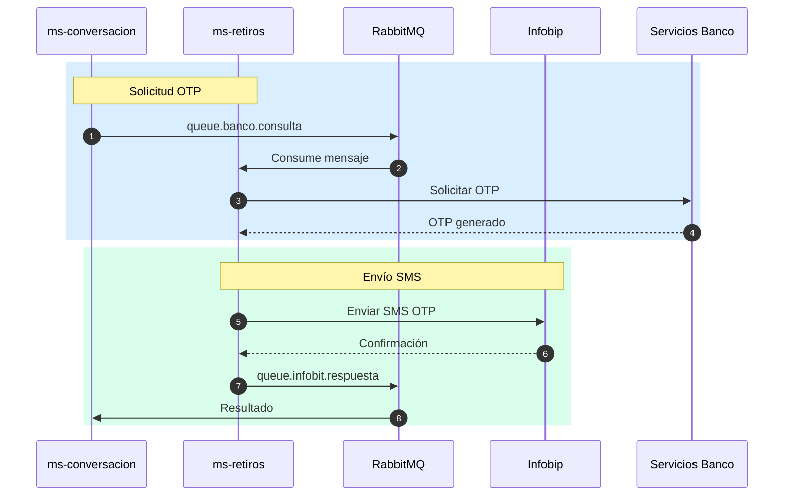

# Contexto del Proyecto: ms-banca-retiros

> **Generado:** 2026-02-15  
> **Confianza:** Alto

---

## 📊 Scorecard Ejecutivo

| Aspecto | Puntuación | Estado |
|---------|------------|--------|
| Arquitectura | 9/10 | ✅ Hexagonal + DDD |
| Stack | 9/10 | ✅ Java 21, Spring Boot 3.5.4 |
| Testing | 7/10 | ⚠️ Tests presentes |
| DevOps | 9/10 | ✅ CI/CD completo + K8s |
| Documentación | 5/10 | ⚠️ README básico |

---

## 1. Identificación

- **Nombre:** ms-banca-retiros (MSBancaRetiros)
- **Descripción:** Microservicio para gestión de retiros sin tarjeta con OTP (Infobip + Banco).
- **Tipo:** Microservicio
- **Estado:** Producción
- **Group ID:** co.com.bmm

---

## 2. Stack Tecnológico

### Resumen
| Categoría | Tecnología | Versión |
|-----------|------------|---------|
| Lenguaje | Java | 21 |
| Framework | Spring Boot | 3.5.4 |
| Spring | Spring Framework | 6.2.7 |
| Build | Gradle | 8.x |
| Mensajería | RabbitMQ | - |
| Cache | Redis | - |
| Mapping | MapStruct | 1.6.3 |
| Testing | JUnit 5, Mockito | 3.12.4 |

### Dependencias Core
| Dependencia | Versión | Propósito |
|-------------|---------|-----------|
| spring-boot-starter-web | 3.5.4 | REST API (Undertow) |
| spring-boot-starter-amqp | 3.5.4 | RabbitMQ |
| spring-boot-starter-data-redis | 3.5.4 | Cache Redis |
| mapstruct | 1.6.3 | Object mapping |
| libBancaTransversales | 1.0.8 | Cliente servicios BMM |
| archunit-junit5 | 1.3.0 | Tests arquitectura |

---

## 3. Comandos Clave

```bash
# Build
cd microservicio && ./gradlew clean build

# Tests
./gradlew test

# Docker local
docker-compose up -d

# Ejecutar
./gradlew bootRun
```

---

## 4. Arquitectura

- **Estilo:** Hexagonal (Ports and Adapters)
- **Patrón Principal:** DDD Táctico + Repository + Event-Driven

### Estructura del Proyecto
```
ms-banca-retiros/
├── microservicio/
│   ├── dominio/src/main/java/co/com/bmm/
│   │   ├── modelo/                 # Entidades de dominio
│   │   ├── puertos/                # Interfaces (ports)
│   │   │   ├── PuertoOTPBanco.java
│   │   │   ├── PuertoOTPInfobit.java
│   │   │   └── otpbanking/
│   │   ├── servicios/              # Servicios de dominio
│   │   └── util/                   # Utilidades
│   ├── aplicacion/                 # Use cases
│   ├── infraestructura/            # Adapters
│   │   └── configuracion/
│   │       ├── rabbitmq/           # RabbitMQ config
│   │       ├── redis/              # Redis config
│   │       └── propiedades/        # Properties config
│   └── src/main/resources/
│       └── application.yaml
├── comun/                          # Módulos compartidos locales
├── Dockerfile
├── deployment.yaml
└── docker-compose.yml
```

### Componentes Principales
| Componente | Ubicación | Responsabilidad |
|------------|-----------|-----------------|
| PuertoOTPBanco | dominio/puertos/ | Interfaz OTP con banco |
| PuertoOTPInfobit | dominio/puertos/ | Interfaz OTP con Infobip |
| PuertoOtpBanking | dominio/puertos/otpbanking/ | Operaciones OTP banking |
| Servicios | dominio/servicios/ | Lógica de negocio retiros |

---

## 5. Integraciones

| Tipo | Tecnología | Configuración |
|------|------------|---------------|
| BD Principal | N/A | Sin persistencia local |
| Cache | Redis | spring-boot-starter-data-redis |
| Mensajería | RabbitMQ | Múltiples colas (OTP, errores) |
| OTP SMS | Infobip | API externa |
| OTP Banco | Servicios BMM | libBancaTransversales |
| Secretos | HashiCorp Vault | VAULT_* env vars |

---

## 6. Configuración RabbitMQ

### Exchanges
| Exchange | Tipo | Propósito |
|----------|------|-----------|
| exchange.errores.servicio-externo | topic | Errores de servicios |
| exchange.retiros.otp | topic | Flujo OTP |

### Colas
| Cola | Routing Key | Propósito |
|------|-------------|-----------|
| queue.infobit.respuesta | routing.key.infobit.respuesta | Respuestas Infobip |
| queue.infobit.consulta | routing.key.infobit.consulta | Consultas Infobip |
| queue.banco.consulta | routing.key.banco.consulta | Consultas OTP banco |

### Configuración Listener
- **concurrent-consumers:** 3
- **max-concurrent-consumers:** 10
- **prefetch-count:** 10
- **x-queue-type:** quorum (HA)
- **x-delivery-limit:** 5 (antes de DLQ)

---

## 7. Configuración Infobip

```yaml
infobip:
  api-key: ${INFOBIP_API_KEY}
  base-url: ${INFOBIP_BASE_URL}
  sms:
    sender: ${INFOBIP_SMS_SENDER}
    message: ${INFOBIP_SMS_CONTENT}
  tfa:
    application-id: ${INFOBIP_TFA_APPLICATION_ID}
    message-id: ${INFOBIP_TFA_MESSAGE_ID}
```

---

## 8. DevOps

| Aspecto | Estado | Archivo |
|---------|--------|---------|
| Dockerfile | ✅ | Dockerfile |
| Docker Compose | ✅ | docker-compose.yml |
| CI/CD | ✅ | azure-pipelines.yml |
| IaC | ✅ | deployment.yaml (K8s) |

**Puertos:** 8080  
**Profiles:** develop, prepro, pro

---

## 9. Diagrama de Flujo OTP



---

## 10. Puntos de Atención

### 🟠 Importantes
- Integración crítica con Infobip para SMS
- Colas con DLQ para manejo de fallos
- Secretos sensibles (API keys) en Vault

### 🟢 Sugerencias
- Documentar flujo OTP completo con ADR
- Implementar circuit breaker para Infobip
- Monitorear tasa de entrega SMS

---

## 📜 Historial

| Fecha | Acción | Detalle |
|-------|--------|---------|
| 2026-02-15 | Análisis inicial | Generado por >tomar_contexto |
| 2026-02-15 | Reglas arquitectónicas | Configuradas por >init_reglas_arquitectonicas |

---

## 📎 Referencias

### Reglas Arquitectónicas
- **Archivo:** `.SAC/artifacts/contextos/reglas_arquitectonicas_ms-banca-retiros.md`
- **Generado:** 2026-02-15
- **Versión:** 1.0
- **Estado:** ✅ Configurado

---

> **Archivo generado automáticamente.**  
> **Proyecto:** ms-banca-retiros  
> **Workspace:** bmm

