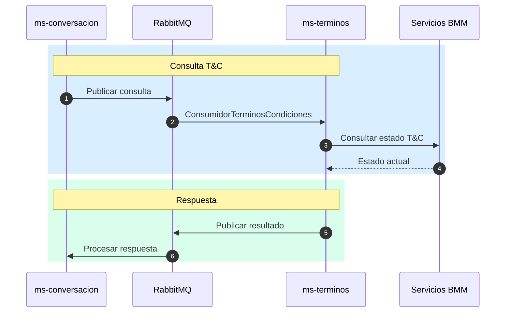

# Contexto del Proyecto: ms-banca-terminos-condiciones

> **Generado:** 2026-02-15  
> **Confianza:** Alto

---

## 📊 Scorecard Ejecutivo

| Aspecto | Puntuación | Estado |
|---------|------------|--------|
| Arquitectura | 9/10 | ✅ Hexagonal + DDD |
| Stack | 9/10 | ✅ Java 21, Spring Boot 3.5.4 |
| Testing | 8/10 | ✅ Tests + ArchUnit |
| DevOps | 9/10 | ✅ CI/CD completo + K8s |
| Documentación | 7/10 | ✅ README detallado |

---

## 1. Identificación

- **Nombre:** ms-banca-terminos-condiciones (MSBancaTerminosCondiciones)
- **Descripción:** Microservicio para gestión de aceptación de términos y condiciones de usuarios.
- **Tipo:** Microservicio
- **Estado:** Producción
- **Group ID:** co.com.bmm

---

## 2. Stack Tecnológico

### Resumen
| Categoría | Tecnología | Versión |
|-----------|------------|---------|
| Lenguaje | Java | 21 |
| Framework | Spring Boot | 3.5.4 |
| Spring | Spring Framework | 6.2.7 |
| Build | Gradle | 8.x |
| Mensajería | RabbitMQ | - |
| Cache | Redis | - |
| Mapping | MapStruct | 1.6.3 |
| Testing | JUnit 5, Mockito | 3.12.4 |

### Dependencias Core
| Dependencia | Versión | Propósito |
|-------------|---------|-----------|
| spring-boot-starter-web | 3.5.4 | REST API (Undertow) |
| spring-boot-starter-amqp | 3.5.4 | RabbitMQ |
| spring-boot-starter-data-redis | 3.5.4 | Cache Redis |
| mapstruct | 1.6.3 | Object mapping |
| libBancaTransversales | 1.0.8 | Cliente servicios BMM |
| archunit-junit5 | 1.3.0 | Tests arquitectura |

---

## 3. Comandos Clave

```bash
# Build
cd microservicio && ./gradlew clean build

# Tests
./gradlew test

# Docker local
docker-compose up -d

# Ejecutar
./gradlew bootRun
```

---

## 4. Arquitectura

- **Estilo:** Hexagonal (Ports and Adapters)
- **Patrón Principal:** DDD Táctico + Event-Driven (Consumer/Publisher)

### Estructura del Proyecto
```
ms-banca-terminos-condiciones/
├── microservicio/
│   ├── dominio/src/main/java/co/com/bmm/
│   │   ├── modelo/                 # Entidades de dominio
│   │   ├── puertos/                # Interfaces (ports)
│   │   │   ├── PuertoConsultarTerminosYCondiciones.java
│   │   │   └── PuertoAceptarTerminosYCondiciones.java
│   │   ├── servicios/              # Servicios de dominio
│   │   └── util/                   # Utilidades
│   ├── aplicacion/                 # Use cases
│   ├── infraestructura/
│   │   ├── consumidores/           # RabbitMQ listeners
│   │   │   └── ConsumidorTerminosCondiciones.java
│   │   ├── publicadores/           # RabbitMQ publishers
│   │   │   └── PublicadorEventosErrorRabbit.java
│   │   ├── servicios/              # External service adapters
│   │   └── configuracion/
│   │       ├── rabbitmq/
│   │       ├── redis/
│   │       └── propiedades/
│   └── src/                        # Main app
├── comun/                          # Módulos compartidos locales
├── Dockerfile
├── deployment.yaml
└── docker-compose.yml
```

### Componentes Principales
| Componente | Ubicación | Responsabilidad |
|------------|-----------|-----------------|
| PuertoConsultarTerminosYCondiciones | dominio/puertos/ | Consulta de T&C |
| PuertoAceptarTerminosYCondiciones | dominio/puertos/ | Aceptación de T&C |
| ConsumidorTerminosCondiciones | infraestructura/consumidores/ | Listener RabbitMQ |
| PublicadorEventosErrorRabbit | infraestructura/publicadores/ | Publisher errores |
| EjecutorServicioTerminosCondicionesBmm | infraestructura/servicios/ | Integración BMM |

---

## 5. Integraciones

| Tipo | Tecnología | Configuración |
|------|------------|---------------|
| BD Principal | N/A | Sin persistencia local |
| Cache | Redis | spring-boot-starter-data-redis |
| Mensajería | RabbitMQ | Consumer/Publisher pattern |
| Servicios BMM | HTTP | libBancaTransversales |
| Secretos | HashiCorp Vault | VAULT_* env vars |

---

## 6. Flujo de Mensajería

El microservicio **espera eventos** de la cola configurada en `${rabbitmq.queue.consulta.name}` y **responde** con los resultados.

### Consumer
```java
@RabbitListener(queues = "${rabbitmq.queue.consulta.name}")
public void procesarConsulta(Message message) { ... }
```

### Publisher (Errores)
```java
@Component
public class PublicadorEventosErrorRabbit {
    public void publicarError(ErrorEvento evento) { ... }
}
```

---

## 7. DevOps

| Aspecto | Estado | Archivo |
|---------|--------|---------|
| Dockerfile | ✅ | Dockerfile |
| Docker Compose | ✅ | docker-compose.yml |
| CI/CD | ✅ | azure-pipelines.yml |
| IaC | ✅ | deployment.yaml (K8s) |

**Puertos:** 8080  
**Profiles:** develop, prepro, pro

---

## 8. Tests de Arquitectura

El proyecto incluye tests de ArchUnit para validar:
- Controladores con `@RestController`, `@RequestMapping` y `@Tag`
- Separación de capas
- Convenciones de nomenclatura

```java
@DisplayName("Valida que las consultas contengan @RestController, @RequestMapping y Tag")
void testControladores() { ... }
```

---

## 9. Diagrama de Flujo



---

## 10. Puntos de Atención

### 🟢 Sugerencias
- Documentar versiones de T&C activos con ADR
- Considerar cache de T&C activos en Redis

---

## 📜 Historial

| Fecha | Acción | Detalle |
|-------|--------|---------|
| 2026-02-15 | Análisis inicial | Generado por >tomar_contexto |

---

> **Archivo generado automáticamente.**  
> **Proyecto:** ms-banca-terminos-condiciones  
> **Workspace:** bmm

