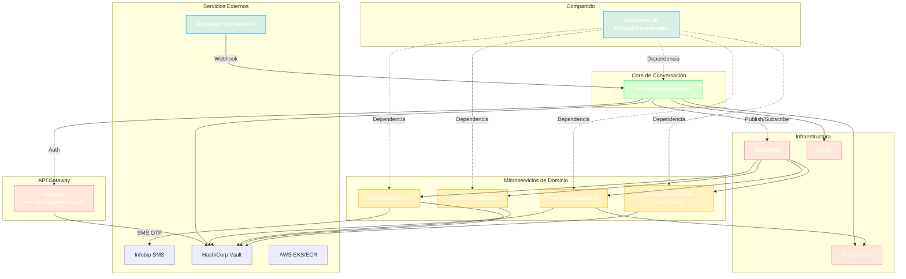

# Workspace: BMM (Banca por WhatsApp)

> **Generado:** 2026-02-15  
> **Tipo:** Multi-Proyecto  
> **Total Proyectos:** 7

---

## 📊 Resumen del Workspace

| # | Proyecto | Tipo | Stack | Estado | Contexto |
|---|----------|------|-------|--------|----------|
| 1 | comun-svc-lib | Librería | Java 21, Gradle | Producción | [contexto](contextos/contexto_proyecto_comun-svc-lib.md) |
| 2 | ms-banca-auditoria | Microservicio | Java 21, Spring Boot 3.5.5 | Producción | [contexto](contextos/contexto_proyecto_ms-banca-auditoria.md) |
| 3 | ms-banca-autenticacion | Microservicio | Java 21, Keycloak 26.2.4 | Producción | [contexto](contextos/contexto_proyecto_ms-banca-autenticacion.md) |
| 4 | ms-banca-conversacion | Microservicio | Java 21, Spring Boot 3.5.4 | Producción | [contexto](contextos/contexto_proyecto_ms-banca-conversacion.md) |
| 5 | ms-banca-productos | Microservicio | Java 21, Spring Boot 3.5.4 | Producción | [contexto](contextos/contexto_proyecto_ms-banca-productos.md) |
| 6 | ms-banca-retiros | Microservicio | Java 21, Spring Boot 3.5.4 | Producción | [contexto](contextos/contexto_proyecto_ms-banca-retiros.md) |
| 7 | ms-banca-terminos-condiciones | Microservicio | Java 21, Spring Boot 3.5.4 | Producción | [contexto](contextos/contexto_proyecto_ms-banca-terminos-condiciones.md) |

---

## 📊 Scorecard Global

| Aspecto | Puntuación | Estado |
|---------|------------|--------|
| Arquitectura | 8/10 | ✅ Hexagonal consistente |
| Stack | 9/10 | ✅ Java 21, Spring Boot 3.5.x |
| Testing | 7/10 | ⚠️ 472+ tests, cobertura variable |
| DevOps | 9/10 | ✅ CI/CD Azure Pipelines + K8s |
| Documentación | 6/10 | ⚠️ READMEs presentes, falta uniformidad |

**Promedio Global:** 7.8/10

---

## 🔗 Relaciones entre Proyectos

| Proyecto Origen | Proyecto Destino | Tipo Relación |
|-----------------|------------------|---------------|
| comun-svc-lib | Todos los ms-* | Dependencia Maven (libBancaTransversales) |
| ms-banca-conversacion | ms-banca-auditoria | Publica eventos RabbitMQ |
| ms-banca-conversacion | ms-banca-productos | Consume servicios vía RabbitMQ |
| ms-banca-conversacion | ms-banca-retiros | Consume servicios OTP vía RabbitMQ |
| ms-banca-conversacion | ms-banca-terminos-condiciones | Consume servicios vía RabbitMQ |
| ms-banca-conversacion | ms-banca-autenticacion | Valida tokens Keycloak |
| ms-banca-retiros | Infobip | Integración SMS OTP |
| Todos los ms-* | Vault | Gestión de secretos |

---

## 🏗️ Arquitectura del Workspace



---

## 📁 Estructura del Workspace

```
bmm/
├── .SAC/
│   ├── artifacts/
│   │   ├── workspace.md                    # Este archivo
│   │   ├── contextos/
│   │   │   └── contexto_proyecto_*.md      # Contexto por proyecto
│   │   ├── backlog_desarrollo.md           # (Pendiente)
│   │   └── HU/
│   │       ├── compartidas/                # HUs cross-proyecto
│   │       └── [nombre_proyecto]/          # HUs por proyecto
│   └── config/
├── comun-svc-lib/                          # Librería compartida
├── ms-banca-auditoria/                     # Microservicio Auditoría
├── ms-banca-autenticacion/                 # Keycloak + SPI custom
├── ms-banca-conversacion/                  # Orquestador principal
├── ms-banca-productos/                     # Consulta de productos
├── ms-banca-retiros/                       # Retiros + OTP
└── ms-banca-terminos-condiciones/          # Términos y condiciones
```

---

## 🛠️ Stack Tecnológico Consolidado

| Categoría | Tecnología | Versión |
|-----------|------------|---------|
| **Lenguaje** | Java | 21 (LTS) |
| **Framework** | Spring Boot | 3.5.4 - 3.5.5 |
| **Build** | Gradle | 8.x |
| **Autenticación** | Keycloak | 26.2.4 |
| **Mensajería** | RabbitMQ | 3.12 |
| **Cache** | Redis | 7.2 |
| **Base de Datos** | PostgreSQL | 13+ |
| **NoSQL** | DynamoDB | AWS |
| **Contenedores** | Docker | Alpine + Corretto 21 |
| **Orquestación** | Kubernetes (EKS) | AWS |
| **CI/CD** | Azure Pipelines | YAML |
| **Registry** | Amazon ECR | - |
| **Secretos** | HashiCorp Vault | - |
| **Mapping** | MapStruct | 1.6.3 |
| **Testing** | JUnit 5, Mockito, ArchUnit | 5.x |
| **Cobertura** | JaCoCo | 0.8.11 |
| **Mutación** | PIT (Pitest) | 1.15.0 |
| **Seguridad** | OWASP Dependency Check, Gitleaks | - |
| **API Docs** | SpringDoc OpenAPI | 2.3.0+ |

---

## 🔒 Seguridad

| Aspecto | Implementación |
|---------|----------------|
| Autenticación | Keycloak con SPI personalizado |
| Autorización | JWT Tokens |
| Secretos | HashiCorp Vault (AppRole) |
| Certificados | CA interno importado en truststore JVM |
| Escaneo Código | Gitleaks (secretos en código) |
| Escaneo Deps | OWASP Dependency Check |
| SBOM | CycloneDX |
| Container | Usuario no-root, imagen Alpine mínima |

---

## 📋 DevOps

| Aspecto | Estado | Detalle |
|---------|--------|---------|
| Dockerfile | ✅ | Todos los proyectos |
| Docker Compose | ✅ | Desarrollo local |
| CI/CD | ✅ | Azure Pipelines (YAML) |
| Kubernetes | ✅ | deployment.yaml con HPA |
| Ambientes | ✅ | develop / prepro / pro |
| Health Checks | ✅ | Readiness + Liveness probes |
| Logging | ✅ | SLF4J + Logback |

---

## ⚙️ Comandos del Workspace

```bash
# Analizar proyecto específico
>tomar_contexto ms-banca-conversacion

# Analizar todos los proyectos
>tomar_contexto --all

# Ver HUs compartidas
*HU --compartidas

# Ver HUs de un proyecto
*HU --proyecto=ms-banca-conversacion

# Planificar HU cross-proyecto
>planificar_hu --compartidas
```

---

## ⚠️ Puntos de Atención

### 🔴 Críticos
- Ninguno identificado

### 🟠 Importantes
- Versiones de Spring Boot ligeramente diferentes entre proyectos (3.5.4 vs 3.5.5)
- Falta uniformizar cobertura de tests mínima (80% solo en ms-banca-autenticacion)
- Documentación de arquitectura pendiente de ADRs

### 🟢 Sugerencias
- Crear ADRs para decisiones arquitectónicas clave
- Configurar reglas arquitectónicas con `>init_reglas_arquitectonicas`
- Establecer backlog de desarrollo centralizado

---

## 📝 Historial

| Fecha | Acción | Detalle |
|-------|--------|---------|
| 2026-02-15 | Workspace detectado | 7 proyectos identificados |
| 2026-02-15 | Análisis inicial | Generado por >tomar_contexto (exhaustivo) |

---

> **Archivo generado automáticamente por >tomar_contexto**  
> **Usuario:** JavierMaldonado  
> **Profundidad:** exhaustivo

